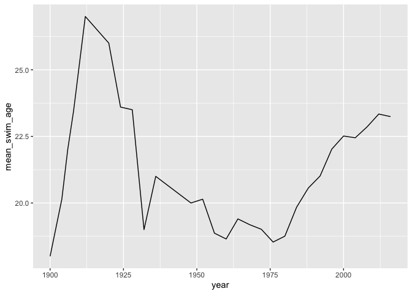
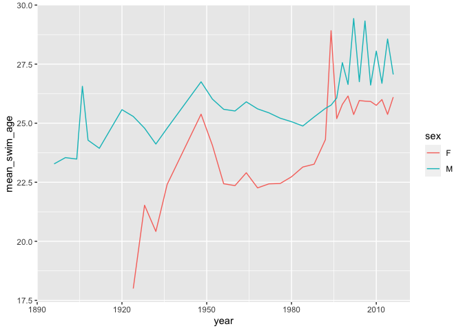
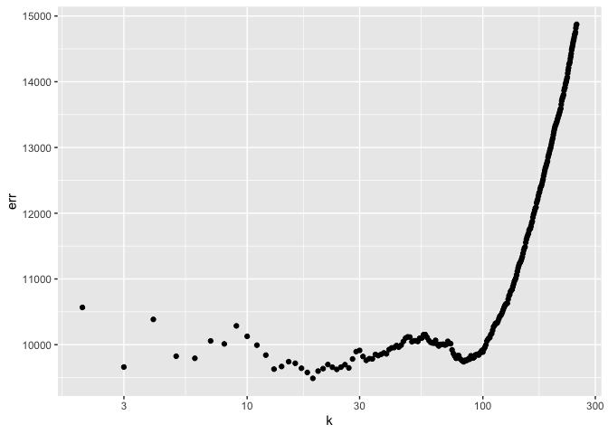
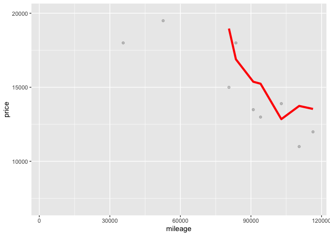
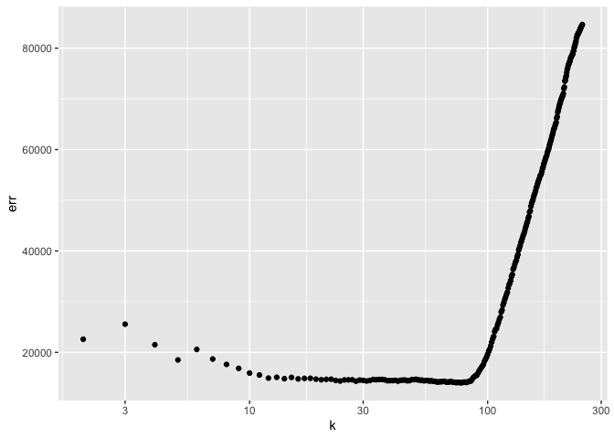
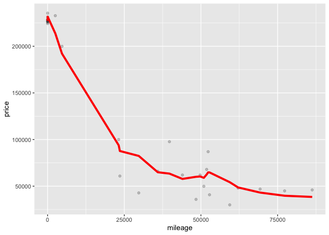

## 1) Data visualization: Flights at ABIA

What is the best time of the year to fly to New York City or Los Angeles
to minimize delays? We’ll pick these two cities because they are the
biggest cities in the United States by population.

NYC Airport Destinations: JFK  
LA Airport Destinations: LAX, SNA, ONT, LGB

    ## `summarise()` has grouped output by 'dest_city'. You can override using the `.groups` argument.

The average total delay time for an October flight to Los Angeles is
-0.2808989!

## 2) Wrangling the Billboard Top 100

Popular music become increasingly diverse until the mid 70s, but drop
rapidly until the turn of the millenium. After that, the diversity of
music rises sharply through present day.

Elton John has the most number of ten-week hits with fifty two of them,
while most of the artists have less than forty.

## 3) Wrangling the Olympics

    ##   q95_height
    ## 1        183

The 95th percentile of heights for female competitors across all
Athletics events is 183.

    ## Selecting by sd_height

    ## # A tibble: 1 x 2
    ##   event                      sd_height
    ##   <chr>                          <dbl>
    ## 1 Rowing Women's Coxed Fours      10.9

Rowing Women’s Coxed Fours had the greatest variability in competitor’s
heights across the entire history of the Olympics with a standard
deviation of 10.9.

The average age of olympic swimmers spikes up in the 1910s and drops
dramatically in the 1920s and stays that way until it starts to steadily
rise in the 1970s. The trend looks similar for both female and male
swimmers but female swimmers started at a much lower average age when
they started competing. While the age gaps closed a bit, it’s mostly
always lower than the average male swimmer age.

## 4) K-nearest neighbors

### Trim 350

The optimal k is 6

### Trim 65

The optimal k is 45

